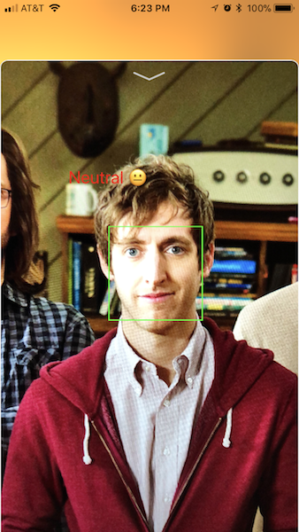

CircleCI status: 

Emotion Sample
===========

Sample Swift app that takes a picture, sends it to Microsoft's [Face API](https://azure.microsoft.com/en-us/services/cognitive-services/face/) to detect emotion and draws emoji to match.

## Getting Started

1. Get [Cognitive Services API key](https://azure.microsoft.com/en-us/try/cognitive-services/?api=face-api) from Microsoft

2. Clone repo

3. Open workspace, replace `COGNATIVE_SERVICE_API_KEY` constant value in AnnotatedPictureViewController.swift with your API key

4. Open project file and set Team under Signing

5. That's it! Run the app, snap away and start detecting emotions!

## CocoaPod referenced

* [PromiseKit](https://cocoapods.org/pods/PromiseKit) ~> 4.4
* [Alamofire](https://cocoapods.org/pods/Alamofire) ~> 4.5

## Features

* Uses Microsoft's [Face API](https://westus.dev.cognitive.microsoft.com/docs/services/563879b61984550e40cbbe8d/operations/563879b61984550f30395236) to detect emotions.
  * This app previously used [Emotion API](https://azure.microsoft.com/en-us/services/cognitive-services/emotion/),  which is now being deprecated. Emotion API features have been integrated into Face API.

* Takes picture and detects immediately - no need to access user's Photo Library.

* Supports multiple faces.

* Once picture is analyzed, it is annotated with rectangle and emoji.

* Quickly dismiss annotated picture by swiping down.

## Leverages

* AVFoundation
  * AVCaptureSession
  * AVCaptureVideoPreviewLayer
  * AVCapturePhotoOutput
* UIKit
  * UITapGestureRecognizer
  * UIVisualEffectView
  * UIPresentationController / UIViewControllerTransitioningDelegate

## App Screenshots

